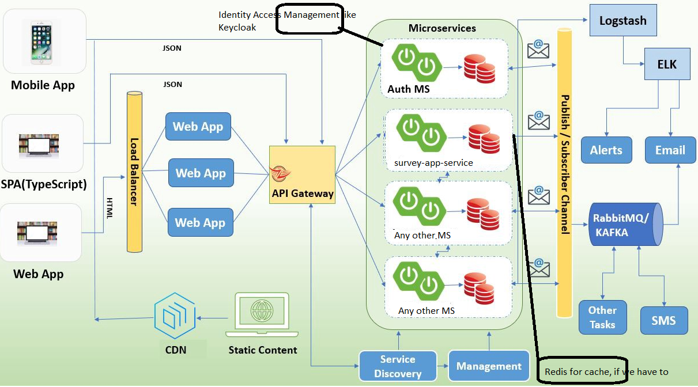

# survey-app-service
Test Instructions

General note:
Do not focus here aspects like authentication, authorization or anything front-end related.
Apart from this, everything is on the table. We would like to see how you approach and
structure a project and be ready to demo the implemented parts.
Source code:
Please use only with java/kotlin.
Material submission:
Please upload your code in any public git repo.

Task

Design the back-end for a survey application: It should give the capability for simple polls comprising
questions with multiple choice answers. Follow preferably the Microservices architecture pattern. Keep
in mind the following features:
a) Add/edit/delete questions and answers
b) read a list of all questions
c) read a question with all answers
d) respond to a survey
e) Get the relative distribution of a selected answer by question
1. Prepare a small documentation about your project and design.
2. Define the REST-skeletons with the service-endpoints in question, preferably Spring.
3. Implement the add /delete endpoint of a) for questions and answers, the service(s)-endpoint(s) to
   respond to a survey d) and the endpoint to receive the result per answer e)


The URL to access backend APIs
http://localhost:8080/doc/survey-app-service/swagger-ui/index.html#/

Build instructions
Backend:
1. mvn clean
2. mvn install -Dmaven.test.skip=true

### :computer: Technology Stack:
* Open JDK 11
* Spring Boot
* Spring Data JPA
* REST API
* JSON
* h2
* Docker
* Intellij Community
* lombok
* OpenAPI Swagger


### Prerequisites
What software or accounts you need to create or install
- [Docker Hub Account](https://hub.docker.com/)
    - yourHubUsername -> Docker ID
    - yourRepo        -> Repository created on Docker Hub
- Download -> [Docker for Mac (or Windows)](https://store.docker.com/search?type=edition&offering=community)
- [Maven build tool](https://maven.apache.org/download.cgi)

## :cloud: Deployment
### Docker
Docker Container

| Action        | Command       |
| ------------- | ------------- |
| List          | docker ps -a  |
| Remove        | docker rm "NAMES" |
| Stop          | docker stop “NAMES” |
| Logs          | docker logs “NAMES” |

Docker Images

| Action        | Command       |
| ------------- | ------------- |
| List          | docker images |
| Remove        | docker rmi “REPOSITORY/IMAGE ID”

### Steps to create & push image from local machine to Docker Hub
```
1. Navigate to the DIR containing Dockerfile
2. Generate jar file
   1. mvn clean install -Dmaven.test.skip=true
3. Generate docker image
   1. docker login -u=yourHubUsername
   2. docker build . -t <APPLICATION_NAME>:<TAG_NAME>
   3. docker images
   4. docker tag <IMAGE_ID> yourHubUsername/yourRepo:<TAG_NAME>
   5. docker push yourHubUsername/yourRepo
```
### Configuration on AWS console
```
4. Update and install docker
   1. sudo apt update
   2. sudo apt install docker.io
   3. sudo service docker start
   4. sudo usermod -a -G docker ubuntu
   5. exit (login again to ec2 instance)
   6. docker info

5. Login to docker hub
   1. docker login -u=yourHubUsername
   2. docker images
```
6. h2 console
   http://localhost:8080/h2-console/login.do?jsessionid=d987f6a45ae679b37ebd9c5eb42cf9c9

### Pull and Run Spring Boot container and Link with h2
```
8. Pull Spring Boot app
   1. docker pull yourHubUsername/yourRepo:<TAG_NAME>
9. Link and Run Spring Boot app
   1. docker run -p 8080:8080 --name <APPLICATION_NAME> --link <APPLICATION_DB_NAME>:mysql -d yourHubUsername/yourRepo:<TAG_NAME>
10. Check Logs
    - docker logs <APPLICATION_NAME>
    - docker logs <APPLICATION_DB_NAME>
```
### In case you need to stop & remove containers
```
Stop
- docker stop <APPLICATION_NAME>
- docker stop <APPLICATION_DB_NAME>
- docker rm <APPLICATION_DB_NAME> -v (-v : Option deletes the docker volume created for the mysql container)
Remove containers
- docker rm <APPLICATION_NAME>
- docker rm <APPLICATION_DB_NAME>
Remove images
- docker rmi yourHubUsername/yourRepo:airline-app
- docker rmi mysql:latest
```

##Possible Future Microservices Design/Architecture


## Authors

:octocat: **Sachin Nikam** - [sachin-nikam-1096b016]( linkedin.com/in/sachin-nikam-1096b016)


### Reference Documentation
For further reference, please consider the following sections:

* [Official Apache Maven documentation](https://maven.apache.org/guides/index.html)
* [Spring Boot Maven Plugin Reference Guide](https://docs.spring.io/spring-boot/docs/2.7.0/maven-plugin/reference/html/)
* [Create an OCI image](https://docs.spring.io/spring-boot/docs/2.7.0/maven-plugin/reference/html/#build-image)
* [Spring Boot DevTools](https://docs.spring.io/spring-boot/docs/2.7.0/reference/htmlsingle/#using-boot-devtools)
* [Spring Data JPA](https://docs.spring.io/spring-boot/docs/2.7.0/reference/htmlsingle/#boot-features-jpa-and-spring-data)
* [Spring Reactive Web](https://docs.spring.io/spring-boot/docs/2.7.0/reference/htmlsingle/#web.reactive)

### Guides
The following guides illustrate how to use some features concretely:

* [Accessing Data with JPA](https://spring.io/guides/gs/accessing-data-jpa/)
* [Building a Reactive RESTful Web Service](https://spring.io/guides/gs/reactive-rest-service/)

